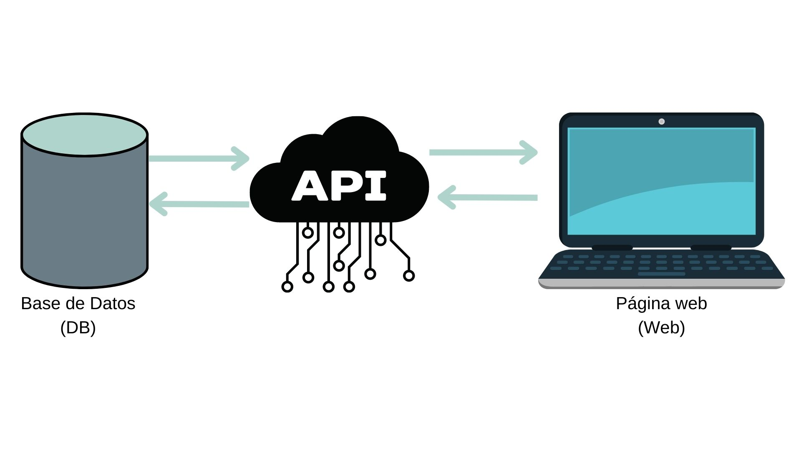

# Funcionamiento de la Base de datos conectada con el sitio web

La aplicación tiene que estar dividida en 3 partes para su correcto funcionamiento:

1. **Base de datos:** guarda la información de la aplicación. Esta hecha con MySql.
2. **Sitio web:** muestra la información de la aplicación. Esta hecha con HTML, CSS y JavaScript.
3. **API:** se conecta con la base de datos y le manda la información al sitio web. Esta hecha con NodeJs.

El flujo de datos se ve de la siguiente manera:

## Pasos para la instalación de la aplicación. (Solo la primera vez)

1. Descargar [NodeJs](https://nodejs.org/en/download/)
2. Descargar [MySql y Workbench](https://github.com/alexroel/tutoriales/blob/master/instalar-mysql.md)
3. Abre el proyecto en VS Code
4. Ejecutar la base de datos en workbench + crear y agregar información a la base de datos `queries.sql`
5. Alterar la contraceña de la base de datos.
6. Correr la base de datos de la tienda desde workbench con `use tienda_online`
7. Dirigirse a la carpeta del api con `cd api` desde el terminal de VS code
8. Instalar las dependencias del API con `npm install` (en caso de que no tenga la carpeta node_modules)
9. Cambiar las credenciales (usuario y password) en caso de ser necesario desde el archivo `index.js` del API
10. Ejecutar el API con `npm run start` desde el terminal de VS code
12. Abri VS Code e instalar **Live server** en la tienda de extensiones
13. Abrir el sitio web en el navegador con **Go live**
14. Comenzar a agregar datos desde workbench `insert.slq`

## Pasos para ejecutar el proyecto despues que se instalo

1. Abrir Workbech y ejecutar `use tienda_online`.
2. Abrir el terminal de vs code
3. Ejecutar `cd api` en el terminal.
4. Ejecutar `npm run start` en el terminal.
5. Abrir la página con **Go Live**.
